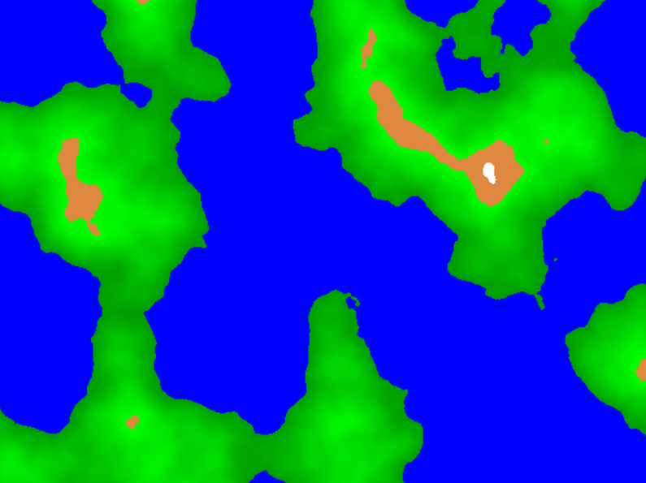

# rust-terrain-gen
A Rust project amenable to newcomers to the language. A working demo using web assembly (i.e. Rust running natively in your browser) is available at thebutlah.github.io/rust-terrain-gen

Example of generated terrain:

